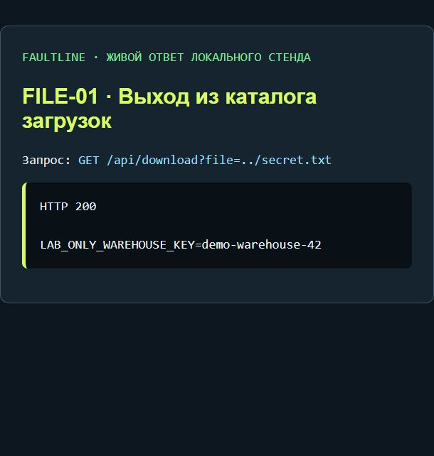

# Файлы: от пользовательского имени к доступу за пределами публичного каталога

**Автор:** Chikhladze · **Проект:** Faultline Shop · **Раздел:** 2 учебных сценария работы с файлами

Файловая уязвимость возникает, когда приложение использует переданное пользователем имя для выбора файла, но проверяет доступ относительно слишком широкого каталога. В этом стенде маршрут скачивания должен выдавать публичные файлы, однако позволяет читать и другие данные лаборатории.

## Карта исследования

| Сценарий | Точка входа | Что меняется | Ключевое доказательство |
|---|---|---|---|
| [FILE-01 · Выход из публичного каталога](#file-01) | `GET /api/download` → `file` | Путь к читаемому файлу | Учебный секрет вместо публичной квитанции |
| [FILE-02 · Активная HTML-загрузка](#file-02) | `POST /api/upload` → `name`, `content`; `GET /uploads/*` | Загруженный HTML выполняется в origin магазина | Маркер `document.body.dataset.labXss="yes"` при открытии файла |

## Подготовка стенда и фиксация результатов

В терминале из корня проекта запустите сервер (проект требует Node.js 24+):

```sh
npm start
```

Во втором терминале проверьте доступность:

```sh
node scripts/lab-cli.mjs health
```

Ожидаемый ответ:

```text
<<< STATUS 200
<<< BODY {"lab":"faultline-local-only","version":1}
```

Откройте `http://127.0.0.1:3000`, затем **F12 → Console** и один раз определите помощник:

```js
var lab = async (route, data) => {
  const response = await fetch(route, data === undefined ? {} : {
    method: 'POST',
    headers: {'Content-Type': 'application/json'},
    body: JSON.stringify(data)
  });
  const text = await response.text();
  console.log('STATUS', response.status, 'ANSWER', text);
  try { return JSON.parse(text); } catch { return text; }
};
```

`undefined` после определения функции — нормальный результат. Команды выполняйте по одному блоку. После обновления страницы функцию нужно определить снова. Запросы и ответы можно сохранить через **Network → Fetch/XHR → Headers / Response**.

---

<a id="file-01"></a>
# FILE-01: Directory traversal — высокая; ограниченная демонстрация

## Воспроизведение, проявление и лечение

**Механизм:** имя файла разрешается относительно `data/public`, но проверяется только принадлежность общей `data`. `..` позволяет выйти из публичной подпапки. **Где:** `/api/download`, `path.resolve(DATA,'public',...)`.

**Проявление:** `await lab('/api/download?file=../secret.txt')` возвращает `LAB_ONLY_WAREHOUSE_KEY`. Обычный `file=receipt.txt` возвращает квитанцию. **Влияние:** чтение непубличных файлов в разрешённом корне. Настоящие файлы ОС ограничитель не пропускает; файлы лаборатории не должны быть симлинками наружу.

**Лечение:** сопоставление разрешённых ID с известными файлами; при работе с путями — realpath и проверка относительно именно публичного корня с учётом симлинков и разделителей ОС. После исправления квитанция доступна, `../secret.txt` даёт 403/404. Проверить и Windows-разделители, и кодирование параметра.


## Скриншот живого ответа



*FILE-01: выход из каталога раскрыл учебный секрет.*

<a id="file-02"></a>
# FILE-02: Активная HTML-загрузка в origin магазина — высокая

## Воспроизведение, проявление и лечение

**Механизм:** API принимает `.html`, сохраняет содержимое и отдаёт как `text/html` с origin приложения. Это не выполнение кода на сервере: код выполняет браузер при открытии файла.

**Где:** `/api/upload`, `/uploads/*`. **Проверка:**

```js
await lab('/api/upload', {name:'proof.html',content:'<h1>Учебный файл</h1><script>document.body.dataset.labXss="yes"</script>'});
```

Откройте `/uploads/proof.html`, проверьте маркер. **Влияние:** stored XSS через файловую поверхность; доступ к origin и действиям текущего пользователя.

**Лечение:** разрешённые безопасные типы по содержимому, переименование файлов, отдельный origin без cookie, `Content-Disposition: attachment`, `nosniff`, исключение активных форматов. Не полагаться только на расширение. После исправления файл либо отклоняется, либо скачивается без исполнения в origin магазина.


# FILE-03: Загрузка без владельца и перезапись по имени — средняя

## Воспроизведение, проявление и лечение

**Механизм:** API не требует входа; имя выбирает клиент; запись заменяет существующий файл. **Проверка:** выйдите, загрузите `note.txt` с содержимым `first`, затем снова с `second`; чтение `/uploads/note.txt` покажет `second`.

**Где:** `/api/upload`, `writeFileSync`. **Влияние:** чужой файл может быть изменён, загруженный HTML подменён. Ограничение тела 100 КБ существует, поэтому «неограниченный размер одного файла» здесь не является заданием.

**Лечение:** обязательная сессия, привязка файла к владельцу, случайный серверный ID, запрет перезаписи и квоты. После исправления анонимный upload отклоняется, повторное клиентское имя не заменяет чужой объект. MIME-политика из FILE-02 всё равно нужна.

# FILE-04: Перечисление загруженных файлов — средняя

## Воспроизведение, проявление и лечение

**Механизм:** API возвращает все имена из общей папки без входа. **Проверка:** загрузите `class-a-note.txt`, выйдите, вызовите `await lab('/api/uploads')`. **Влияние:** раскрытие существования и предсказуемых URL чужих файлов.

**Где:** GET `/api/uploads`, `readdirSync`. **Лечение:** удалить directory listing, хранить метаданные и владельца в БД, выдавать только разрешённые пользователю объекты. После исправления anonymous не получает список.

# FILE-05: Публичная резервная копия — критическая

## Воспроизведение, проявление и лечение

**Механизм:** файл/endpoint с названием backup находится в публичном пространстве. **Проверка после logout:** `await lab('/backup/users.json')`. **Влияние:** массовая утечка пользователей и паролей fixture.

**Где:** `/backup/users.json`. **Как искать:** в ZAP/Burp Site map просматривайте необычные маршруты; в исходниках `rg -n "backup|dump|\.sql|\.bak" .`. Не перебирайте пути на чужих сайтах. **Лечение:** резервные копии вне web root, отдельное хранилище с доступом и шифрованием, проверка артефактов сборки.