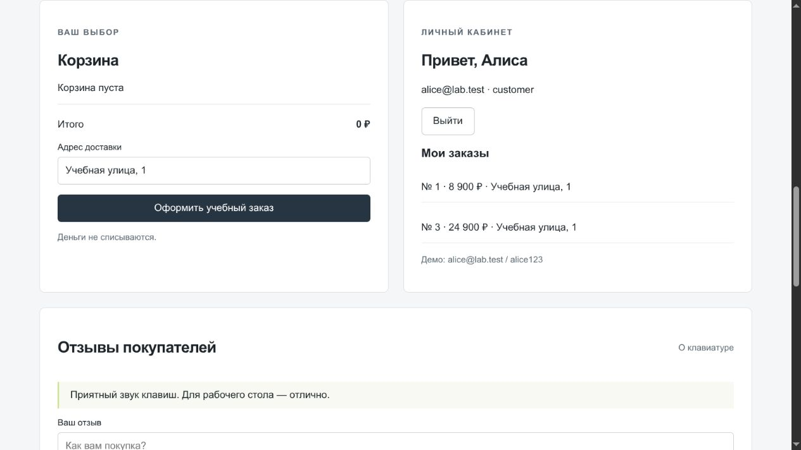

# Отчёт по анализу контроля доступа

**Участник:** Hrustalev\
**Направление:** Контроль доступа\
**Количество находок:** 2\
**Стенд:** `http://127.0.0.1:3000`\
**Среда:** локальный учебный стенд, SQLite fixture-данные, вымышленные
секреты, без внешней сети.

## Цель и методика

Цель --- проверить серверный контроль доступа и определить, может ли
пользователь читать или изменять данные без необходимых полномочий.

В текущем прогоне проверялись **anonymous** (без Cookie) и **customer** (Alice), а также состояние Alice после изменения роли на **admin**. Для каждой проверки фиксировались сессия либо её
отсутствие, HTTP-ответ, возвращаемые данные и фактическое изменение
состояния. Ответ `500` сам по себе не считался доказательством.

## ACCESS-01 --- IDOR чужого заказа

**Критичность:** высокая.

### Механизм

`/api/orders/:id` проверяет наличие сессии, но не владельца заказа.
Выборка выполняется по `id` без ограничения по `user_id`.

### Воспроизведение

Войти под Alice и выполнить:



*Рисунок 1 — исходное состояние: Alice (`alice@lab.test`) авторизована как `customer`; в кабинете отображаются её заказы.*

Открыть последовательно:

```text
/api/orders/1
/api/orders/2
```

[ACCESS-01: собственный заказ Alice: сохранённый HTTP-журнал](html/2.html)

*Доказательство 2 — `/api/orders/1` возвращает заказ с `user_id: 1`, соответствующий Alice.*

[ACCESS-01: чужой заказ Бориса: сохранённый HTTP-журнал](html/3.html)

*Доказательство 3 — при той же сессии `/api/orders/2` возвращает объект с `user_id: 2`, то есть заказ другого пользователя. Это подтверждает IDOR.*

Сравнить `user_id` в двух ответах.

### Наблюдаемое доказательство

При сессии Alice изменение номера заказа возвращает объект другого
пользователя.

### Влияние

Раскрытие истории покупок и персональных данных.

### Первопричина

Выборка вида `WHERE id=?` без проверки владельца.

### Исправление

Использовать `WHERE id=? AND user_id=?` либо централизованную объектную
политику с явным исключением для администратора. UUID не заменяет
проверку полномочий.

### Проверка после исправления

Alice видит свой заказ, но получает `403/404` на чужой. Администратор
получает доступ только по отдельной разрешённой политике.

------------------------------------------------------------------------

## ACCESS-02 --- Административное чтение без входа

**Критичность:** критическая.

### Механизм

Административные GET-маршруты доступны без проверки сессии и роли.

### Воспроизведение

Без Cookie (отдельный анонимный HTTP-клиент) выполнить:

``` javascript
/api/admin/users
/api/admin/orders
```

[ACCESS-02: список пользователей доступен без входа: сохранённый HTTP-журнал](html/4.html)

*Доказательство 4 — без Cookie (отдельный анонимный HTTP-клиент) `/api/admin/users` возвращает записи пользователей и чувствительные поля без административной сессии.*

[ACCESS-02: список заказов доступен без входа: сохранённый HTTP-журнал](html/5.html)

*Доказательство 5 — без Cookie (отдельный анонимный HTTP-клиент) `/api/admin/orders` возвращает заказы разных пользователей без административной сессии.*

### Наблюдаемое доказательство

`HTTP 200` и приватные данные при отсутствии Cookie.

### Влияние

Массовая утечка пользователей, адресов и заказов; открытые пароли
усиливают ущерб.

### Первопричина

GET-маршруты `api/admin` не защищены общей серверной проверкой
административных полномочий.

### Исправление

Применить общий middleware `requireAdmin`, запрет по умолчанию,
фильтрацию полей ответа и тесты для anonymous/customer/admin.

### Проверка после исправления

Anonymous и customer получают `401/403`; admin --- только разрешённые
данные без паролей.

------------------------------------------------------------------------

