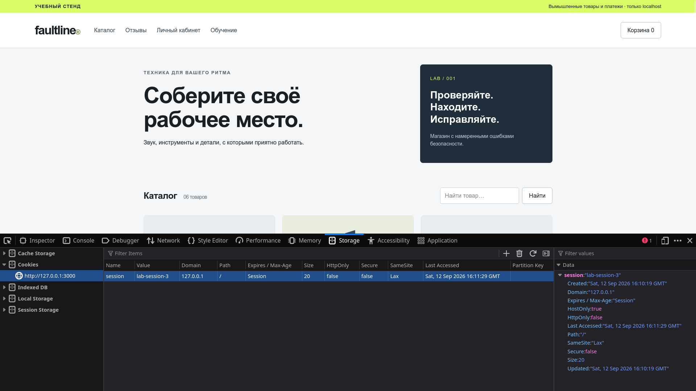
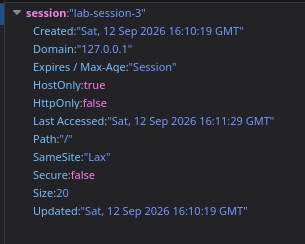
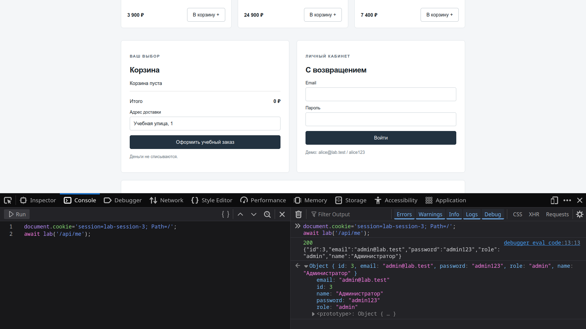
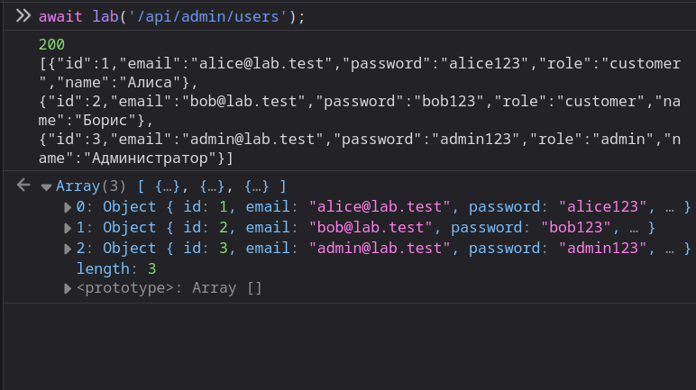
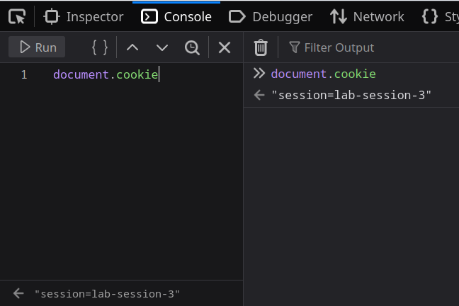
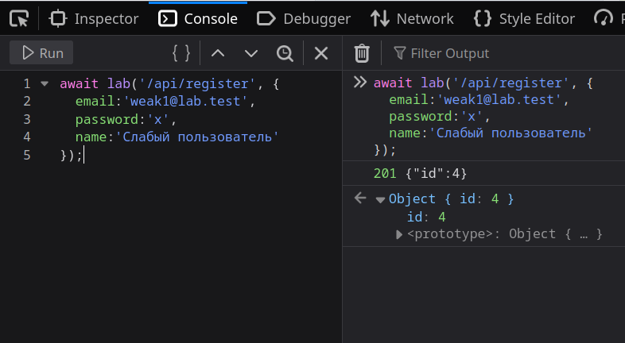
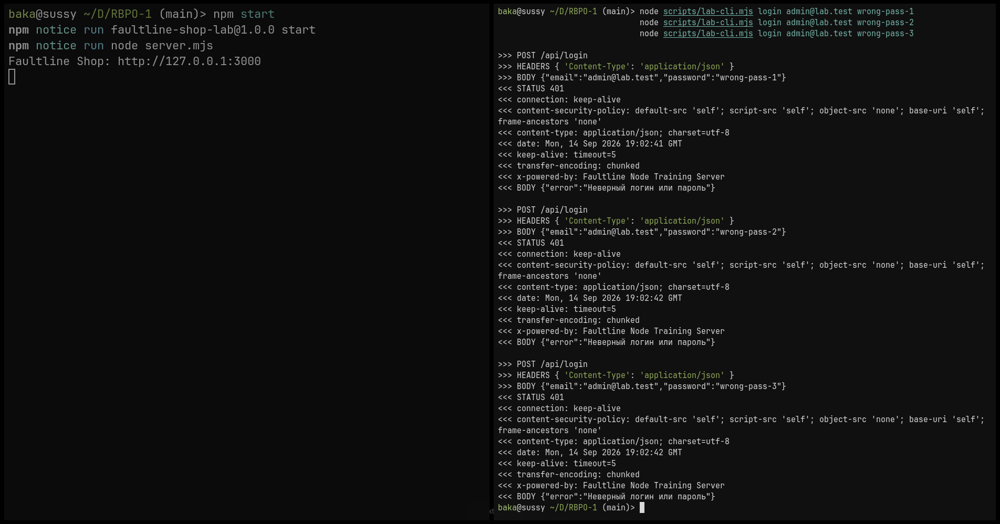
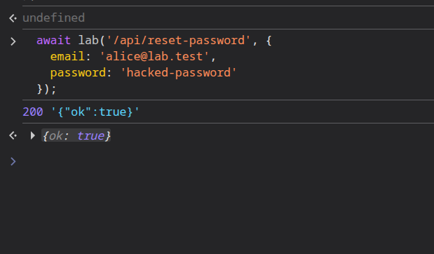
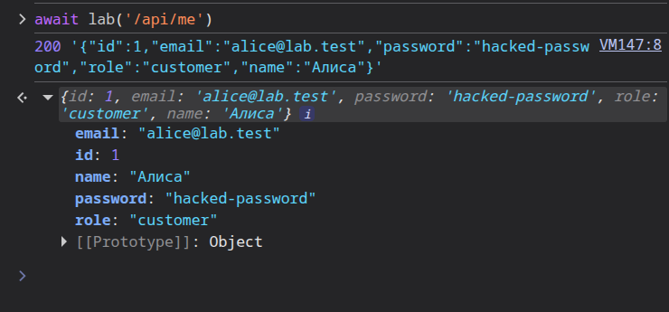
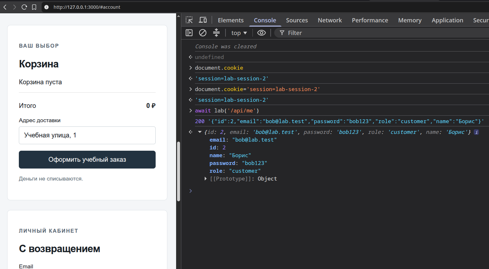

# Материалы проверок: Ульянов Михаил


## Функция для браузерных проверок

``` js
const lab = async (route, data) => {
  if (location.origin !== 'http://127.0.0.1:3000') throw Error('Откройте свой стенд');
  const response = await fetch(route, data === undefined ? {} : {
    method: 'POST', headers: {'Content-Type':'application/json'},
    body: JSON.stringify(data)
  });
  const text = await response.text();
  console.log(response.status, text);
  try { return JSON.parse(text); } catch { return text; }
};
```


## <c>AUTH-01</c> _Предсказуемая сессия_

Войдите администратором через магазин.

`F12` > `Application` > `Storage` > `Cookies` > `http://127.0.0.1:3000`

Можно увидеть cookie session




- **Что произошло?** номер пользователя прямо записан в идентификатор сессии.

- **Можно проверить в консоли**:
  ``` js
  document.cookie='session=lab-session-3; Path=/';
  await lab('/api/me');
  ```

### Уязвимость 1

> **Обрати внимание** на снимке ниже я вне аккаунта, но получил приватную информацию



---
- **Что и почему:** Токен равен `lab-session-{id}`, в нём нет случайности
- **Признак:** разные входы одним пользователем дают одинаковую cookie
- **Влияние:** подмена личности после того, как соответствующая сессия появилась в таблице
---
- **Где:** создание token в /api/login, поиск в user(req)
- **Проверка:** войдите администратором, выйдите, затем в Console выполните `document.cookie='session=lab-session-3; Path=/'` и `await lab('/api/me')`
---
- **Лечение:** криптографически случайный токен минимум 128 бит, хранение его хеша, ротация и срок жизни
  
  Новый вход должен давать новый непредсказуемый токен
  
  угадывание `lab-session-3` не должно работать


## <c>AUTH-02</c> _Пароли хранятся открытым текстом_

Выполняя:
``` js
await lab('/api/admin/users');
```

### Уязвимость 2

Получаю доступ ко всем паролям (в том числе к паролю админа):



---
- **Механизм** `users.password` содержит исходную строку
- **Проявление** `await lab('/api/admin/users')` возвращает список паролей
- **Влияние** чтение БД или этого API раскрывает пароли сразу, без подбора; в настоящих системах возможен ущерб другим сервисам при повторном использовании пароля
---
- **Где** начальные `INSERT`, регистрация, сброс пароля, ответы `/api/login` и `/api/me`
- **Лечение** `Argon2id/scrypt` с индивидуальной солью и подобранной стоимостью
  
  не возвращать пароль или хеш в API
  
  После исправления в БД нет исходного пароля, а ответы содержат только разрешённые поля


## <c>AUTH-03</c> _Cookie доступна JavaScript_

В терминале выполняется:
``` js
document.cookie
```

### Уязвиость 3



Видно что есть доступ к cookie, и к его изменению

---
- **Механизм** отсутствует HttpOnly
- **Признак** после входа `document.cookie` содержит `session=`
- **Влияние** XSS может прочитать идентификатор сессии HttpOnly ограничивает чтение cookie, но не мешает XSS отправлять действия от имени пользователя
---
- **Где** `Set-Cookie` в `/api/login`
- **Лечение** HttpOnly, Secure в HTTPS-окружении, обоснованный SameSite, ограниченный lifetime
  
  После исправления document.cookie не показывает сессию, обычные запросы продолжают работать
  
  В локальном HTTP-стенде Secure требует отдельной настройки HTTPS

## <c>AUTH-04</c> _Слабые и известные пароли_

Выполнияю:
``` js
await lab('/api/register', {
  email:'weak1@lab.test',
  password:'x',
  name:'Слабый пользователь'
});
```

### Уязвимость 4



- **Что произошло** сервер принял пароль из одного символа
---
- **Механизм** регистрация проверяет лишь непустое значение, seed содержит известный пароль администратора
- **Проверка** `await lab('/api/register',{email:'weak@lab.test',password:'x'})` даёт 201
  
  Повтор с тем же email даст ошибку UNIQUE; возьмите другой адрес
---
- **Влияние** простое угадывание пароля, особенно для привилегированных аккаунтов 
- **Где** `/api/register` и `seed`
- **Лечение** разумная минимальная длина, проверка известных скомпрометированных паролей, MFA для администраторов, отсутствие общих заводских паролей в продакшене
  
  Односимвольный пароль после исправления отклоняется с понятным сообщением.


## <c>AUTH-05</c> _Нет ограничения попыток входа_

**Воспроизведение**: Выполните серию запросов с неверным паролем через терминал:

``` js
node scripts/lab-cli.mjs login admin@lab.test wrong-pass-1
node scripts/lab-cli.mjs login admin@lab.test wrong-pass-2
node scripts/lab-cli.mjs login admin@lab.test wrong-pass-3
```



Если сервер каждый раз мгновенно возвращает _401 Unauthorized_ без задержек или временной блокировки, значит, защита от перебора отсутствует.

Сервер обрабатывает каждый запрос на аутентификацию независимо, не учитывая количество предыдущих неудачных попыток. Это позволяет злоумышленникам проводить атаки методом «грубой силы» (brute force) или перебор по словарям (credential stuffing) с высокой скоростью.

- **Механизм**: В эндпоинте /api/login отсутствуют счетчики попыток и логика Rate Limiting.
- **Влияние**: Возможность подбора паролей к учетным записям пользователей и администраторов.
- **Где**: Обработчик маршрута /api/login в server.mjs.
- **Лечение**: Внедрение лимитов по IP и email, использование адаптивных задержек (tarpitting) и блокировка после N неудачных попыток.


## <c>AUTH-06</c> _Сброс пароля без доказательства личности_

- **Воспроизведение**: Выйдите из аккаунта и выполните в Console:
  ``` js
  await lab('/api/reset-password', {
    email: 'alice@lab.test',
    password: 'hacked-password'
  });
  ```



Попробуйте войти с новым паролем hacked-password. Если вход успешен, пароль был изменен без проверки владения почтой.



Функция сброса пароля реализована крайне небезопасно: сервер принимает новый пароль для любого указанного email, не требуя подтверждения через токен в письме или ответа на секретный вопрос.

- **Механизм**: Эндпоинт /api/reset-password выполняет UPDATE в базе данных, основываясь только на предоставленном адресе почты.
- **Влияние**: Полный захват любого аккаунта в системе, зная только email пользователя.
- **Где**: Обработчик /api/reset-password.
- **Лечение**: Реализация классической схемы с отправкой временного случайного токена на email и подтверждением сброса по этой ссылке


# <c>AUTH-07</c> _Регистрация с административной ролью_

**Воспроизведение**: Зарегистрируйте нового пользователя, явно указав роль:

``` js
await lab('/api/register', {
  email: 'attacker@lab.test',
  password: '123',
  role: 'admin',
  name: 'Attacker'
});
```

Проверьте свою роль после входа: await lab('/api/me'). Если в ответе role: "admin", уязвимость подтверждена.
Сервер доверяет данным, присланным клиентом в JSON-теле запроса при регистрации. Несмотря на то, что в интерфейсе поле «роль» отсутствует, API принимает его и записывает в базу данных, позволяя любому пользователю получить права администратора.

- **Механизм**: Прямое сохранение объекта из тела запроса (req.body) в базу данных без фильтрации разрешенных полей.
- **Влияние**: Несанкционированное повышение привилегий до уровня администратора.
- **Где**: Маршрут /api/register.
- **Лечение**: На сервере при регистрации принудительно устанавливать role: "customer", игнорируя ввод пользователя.


## "AUTH-08" _Logout не отзывает сессию и нет срока жизни_

**Воспроизведение**:

Войдите в систему и скопируйте значение сессии из document.cookie.

Нажмите кнопку «Выйти» в интерфейсе.

Верните cookie вручную в Console: `document.cookie='session=...; Path=/'`.

Запросите данные: `await lab('/api/me')`. Если данные получены, старая сессия всё еще активна.



Процедура выхода из системы (logout) реализована только на стороне клиента путем удаления cookie. На сервере запись о сессии в таблице sessions сохраняется навсегда, так как у сессий отсутствует срок жизни (TTL) и механизм явного отзыва.

- **Механизм**: /api/logout не удаляет запись из таблицы sessions, а в схеме БД нет поля expires_at.
Влияние: Угнанная сессия может быть использована вечно, даже если пользователь нажал «Выход» или сменил пароль.
- **Где**: Эндпоинт /api/logout, таблица sessions и Middleware проверки сессии.
Лечение: Обязательное удаление записи из БД при логауте и внедрение проверки времени жизни сессии.


<style>img{height:48rch}c{color:var(--vscode-terminal-ansiGreen);}</style>
